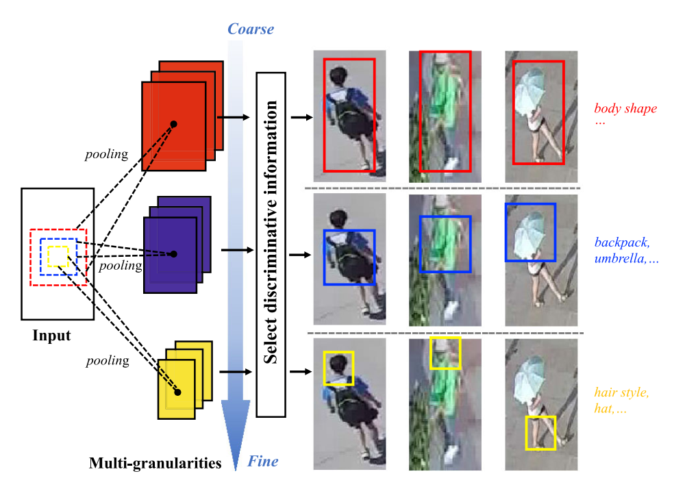
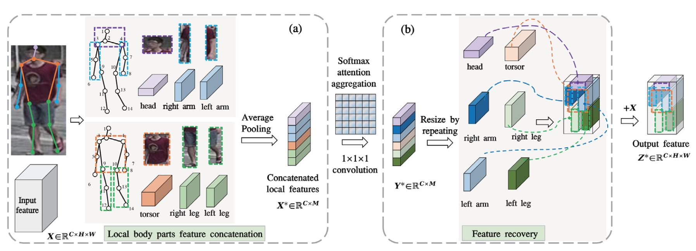
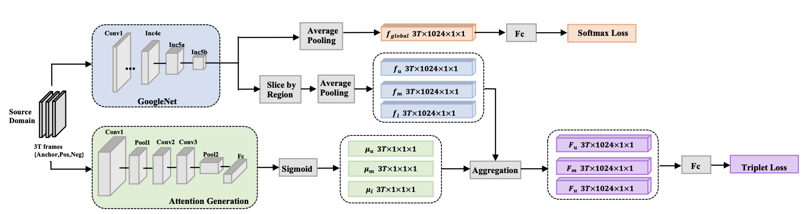

<h3>Postdoctoral Researcher</h3>
ENCODE Lab, School of Engineering  
Westlake University, 310030  
Hangzhou, Zhejiang, China.

Email: <a href="mailto:xusimin@westlake.edu.cn">xusimin@westlake.edu.cn</a> ·
<a href="https://scholar.google.com/citations?user=-9lGlGwAAAAJ">Google Scholar</a> ·
<a href="https://github.com/yourname">GitHub</a>

## Biography
I am a postdoctoral researcher focusing on efficient AI for resource-constrained devices.
I received my B.E. from **Dalian University of Technology**, and my M.S. and Ph.D. from **Shanghai Jiao Tong University**. During my master’s studies, I also completed a joint program at the **University of Toronto**, earning a second M.S. degree.

My research interests include person re-identification, object detection and efficient AI methods.

## Selected Publications
::: {.pub}

  <b>Multi-granularity attention in attention for person re-identification in
aerial images</b> 
  <u>Simin Xu</u>, Lingkun Luo, Haichao Hong, Jilin Hu, Bin Yang, Shiqiang Hu 
  The Visual Computer, 2024   <a class="btn" href="papers/MGAiA.pdf">PDF</a>

:::

::: {.pub}

  <b>Semantic driven attention network with attribute learning for unsupervised person re-identification</b> 
  <u>Simin Xu</u>, Lingkun Luo, Jilin Hu, Bin Yang, Shiqiang Hu 
  Knowledge-Based Systems, 2022   <a class="btn" href="papers/Semantic driven attention network with attribute learning for unsupervised person re-identification.pdf">PDF</a>

:::

::: {.pub}

  <b>Attention-based Model with Attribute Classification for Cross-domain Person Re-identification</b> 
  <u>Simin Xu</u>, Lingkun Luo, Shiqiang Hu 
  International Conference on Pattern Recognition, 2021   <a class="btn" href="papers/Attention-based Model with Attribute Classification for Cross-domain Person Re-identification.pdf">PDF</a>

:::

